# ESP32 Sensors MQTT TFT e-Paper

ESP32 物聯網環境監測與雲端控制實習專案。系統以 ESP32 為核心，整合環境感測、OLED／ILI9225 TFT 顯示、MQTT 雙向通訊、NTP 時間同步、歷史趨勢資料與三色 LED 遠端控制。

## 專案功能

- DHT11 讀取溫度與濕度
- 光敏電阻讀取環境亮度
- OLED 顯示即時感測資料
- ILI9225 TFT 四頁儀表板、Gauge 與歷史折線圖
- 透過 MQTT 發布感測資料並接收 LED 控制指令
- ThingSpeak、Google Sheets 與 LINE 通知整合成果整理
- Wi-Fi／MQTT 斷線重連與 NTP UTC+8 時間同步

## 硬體配置

| 元件 | GPIO／介面 | 用途 |
|---|---|---|
| DHT11 | GPIO14 | 溫度、濕度 |
| 光敏電阻 | GPIO33（ADC） | 環境亮度 |
| OLED | SDA GPIO21、SCL GPIO22 | 即時資訊顯示 |
| ILI9225 TFT | RST26、RS25、CS16、MOSI23、SCK18 | 儀表板與趨勢圖 |
| 綠／黃／紅 LED | GPIO15／GPIO2／GPIO4 | MQTT 遠端控制 |
| 換頁按鍵 | GPIO0，INPUT_PULLUP | 切換四個 TFT 頁面 |

## MQTT 設計

感測資料每 10 秒發布至：

```text
louis/class305/data
```

LED 控制主題：

```text
louis/class305/ctrl/gled
louis/class305/ctrl/yled
louis/class305/ctrl/rled
```

感測資料格式範例：

```json
{"temp":25,"humi":65,"light":95}
```

## 程式功能說明

### `build_final_report.py`

從零建立完整的 ESP32 物聯網成果報告，包含封面、系統架構、硬體腳位、感測資料流程、ThingSpeak、Google Sheets、LINE、MQTT、TFT 儀表板、測試結果與學習心得。程式使用 `python-docx` 建立表格、標題、段落與圖片說明。

### `final_integrated_report.py`

以既有 Word 報告為基礎加入整合版內容，不移除原有學習成果；主要補充 0914 版本的 MQTT、TFT、NTP、歷史趨勢圖、三色 LED 控制、系統架構與實作照片。

### `merge_report_0914.py`

將早期的 DHT11、光敏電阻、OLED、ThingSpeak、Google Sheets 與 LINE 成果，和最新的 MQTT、ILI9225 TFT、NTP、四頁介面及 LED 控制成果合併成一份學習歷程報告。

### `rebuild_report_0914_integrated.py`

重建 0914 整合版報告內容，補上目前版本的系統架構、程式流程、MQTT 主題、TFT 頁面、測試結果與成果照片說明，適合在報告來源或圖片更新後重新輸出。

### `rotate_figures_12_14.py`

以 Pillow 讀取 Word 文件中的指定圖片，旋轉成果照片並重新寫回文件，用來修正照片方向或手機拍攝造成的 EXIF 方向問題。

上述腳本使用 `python-docx` 與 Pillow 產生或處理報告文件；執行前請依本機路徑調整腳本中的 `ROOT`、圖片與報告來源路徑。

## Arduino 範例專案

本 repository 已依學習進度整理 31 個獨立 ESP32 sketch，使用編號資料夾管理，方便由基礎範例一路閱讀到整合系統：

`01_hello` → `02_RGLED` → `08_OLED` → `14_DHT_OLED_RGBLED` → `23_dht_light_oled_thingspeak` → `25_dht_line` → `27_mqtt_ctrl` → `32_ili_mqtt_ctrl_page` → `35_epaper_mqtt`

完整清單與每個範例的功能說明請參閱 [`projects/README.md`](projects/README.md)；線上展示網站也提供可直接開啟的[範例專案目錄](https://monman0201.github.io/esp32-sensors-mqtt-tft-epaper-louis/projects.html)。

公開版本已將 Wi‑Fi、LINE、Google 等服務的憑證改成 `YOUR_...` placeholder，請勿將個人密碼或 API token 提交到公開 repository。

## D 槽完整資料封存

原始工作區 `D:\monman\esp32\ESP32實習` 的完整資料已保留在 [`archive/ESP32實習`](archive/ESP32實習)；包含原始範例資料夾、Arduino libraries、報告文件、交接紀錄、成果圖與報告產出資料。為了公開安全，封存內的程式與文字紀錄已移除已知憑證，並排除含個人識別資訊的兩張照片；原始檔仍保留在本機 D 槽。

## 範例照片與成果說明

以下照片來自本專案的實作與測試過程，涵蓋硬體接線、TFT 顯示、MQTT 與雲端資料服務。

### 硬體與 TFT 顯示

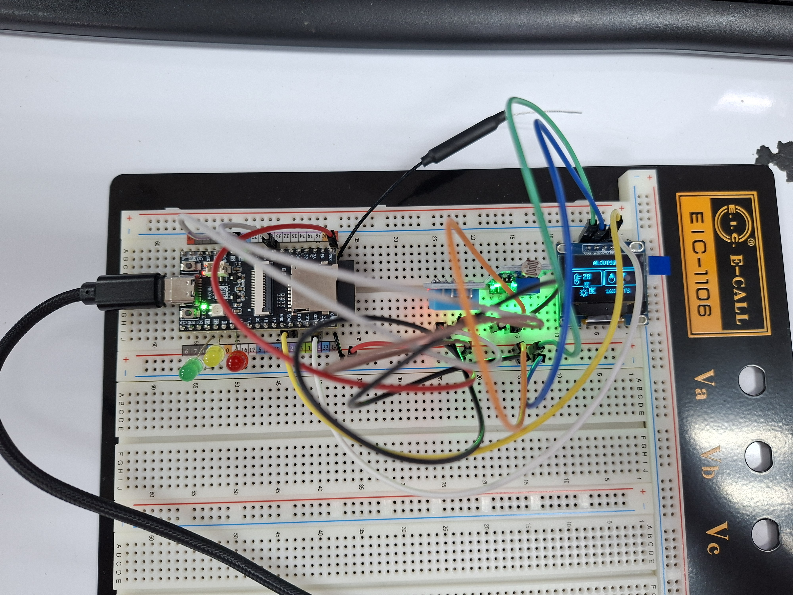

ESP32、感測器、OLED、TFT 與三色 LED 的麵包板整合接線。

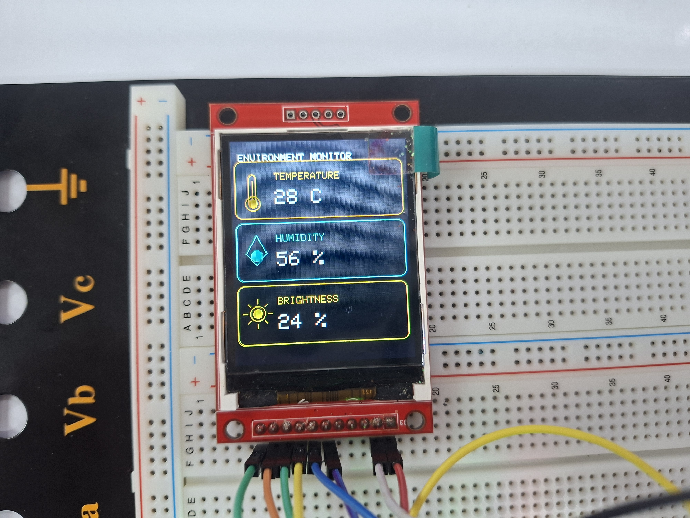

ILI9225 TFT 顯示溫度、濕度與亮度的環境監測首頁。

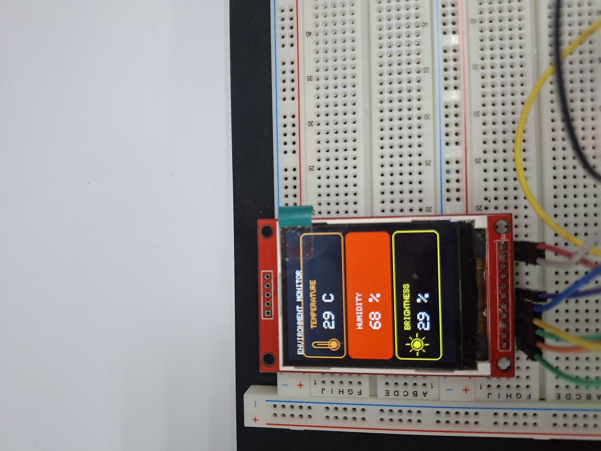

TFT 顯示即時溫度、濕度與亮度數值，並以顏色區分狀態。

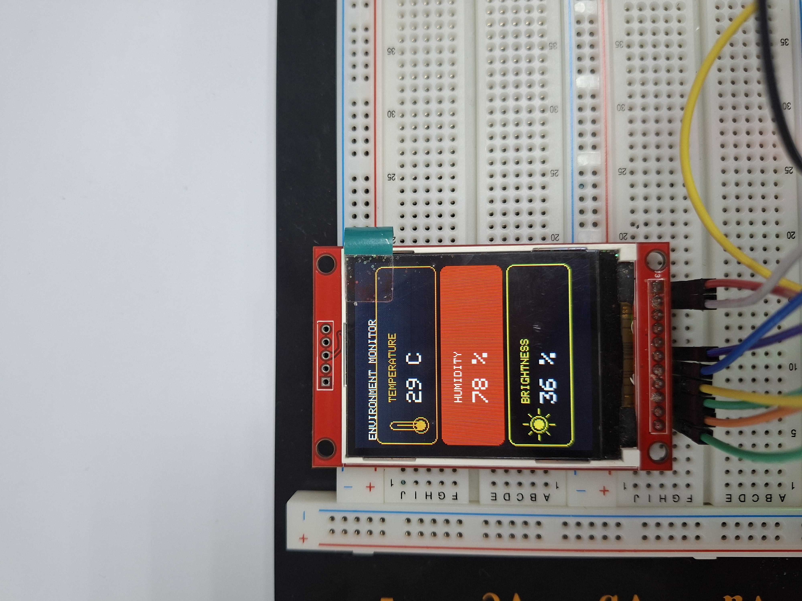

當濕度等環境數值達到警示條件時，畫面會以醒目色彩提示。

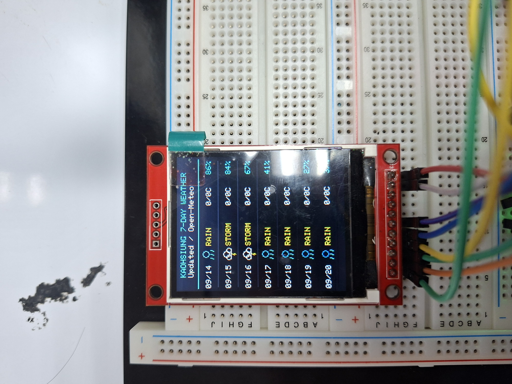

TFT 顯示 Open-Meteo 天氣資料與未來數日預報資訊。

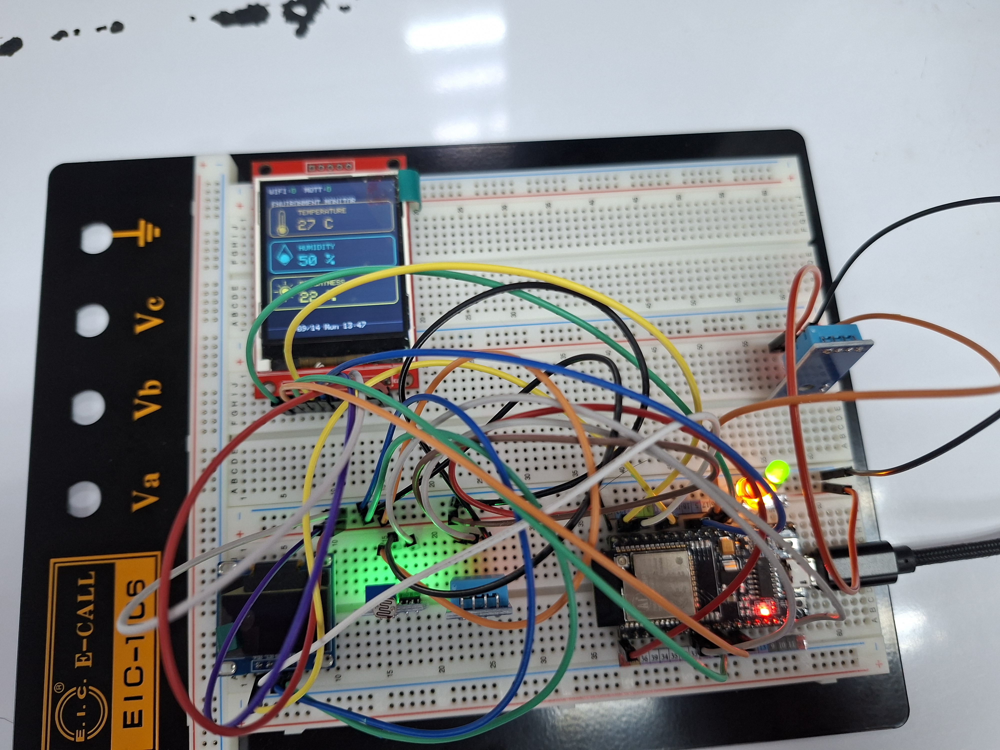

ESP32、DHT11、光敏電阻、ILI9225 TFT 與 LED 的完整整合測試。

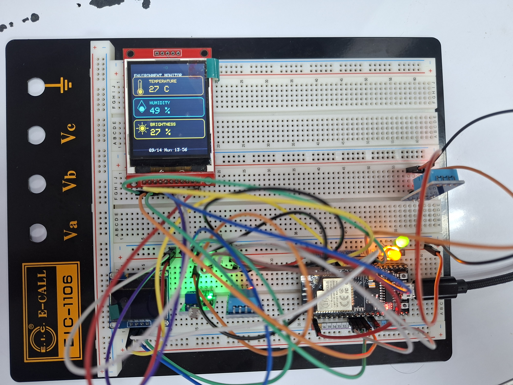

裝置運作時的整體畫面，可看到 TFT 即時數值與多個輸出指示燈。

### MQTT、ThingSpeak 與 Google Sheets

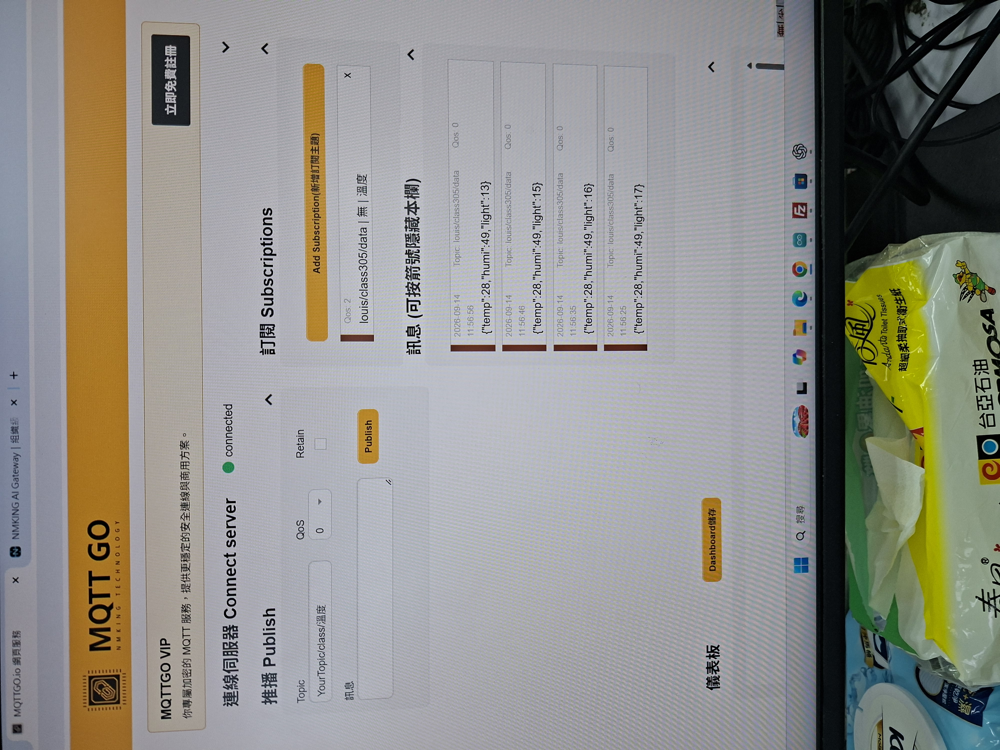

MQTTGO Broker 收到 `louis/class305/data` 主題發布的 JSON 感測資料。

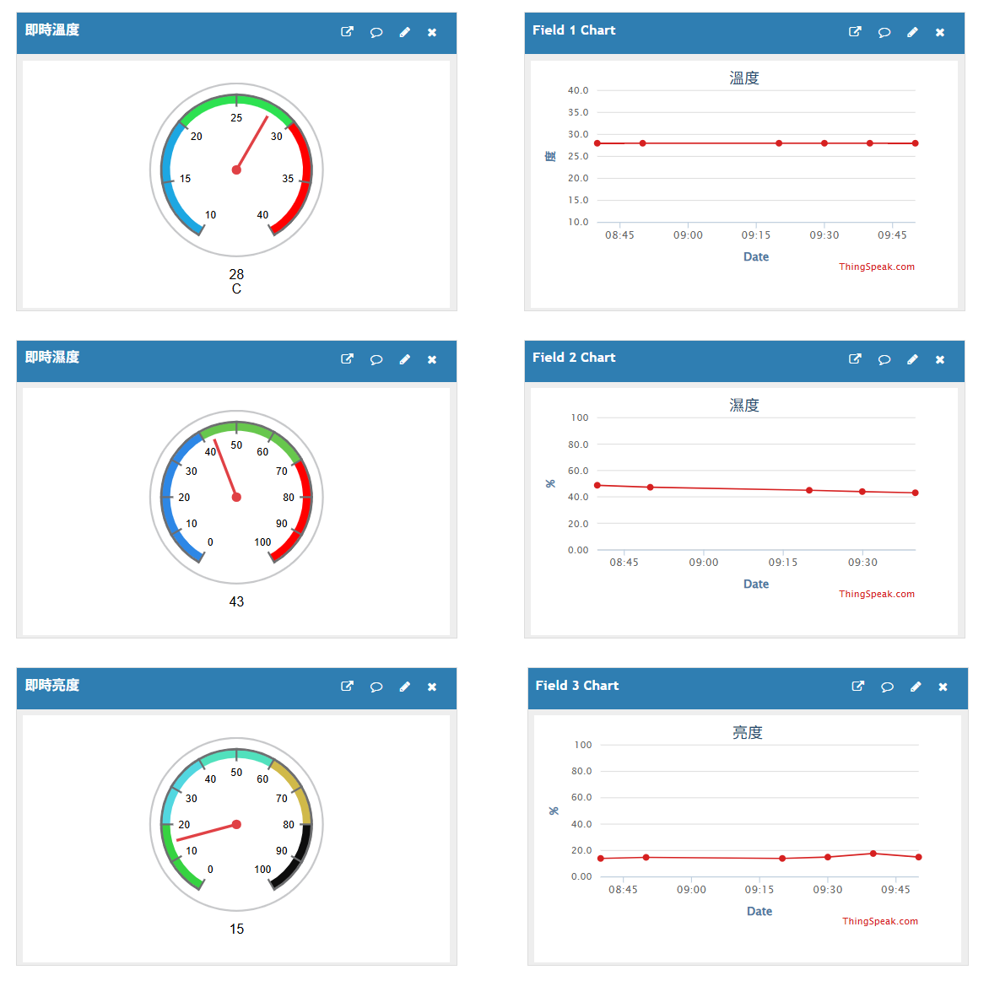

ThingSpeak 儀表板以 Gauge 與折線圖呈現溫度、濕度及亮度。

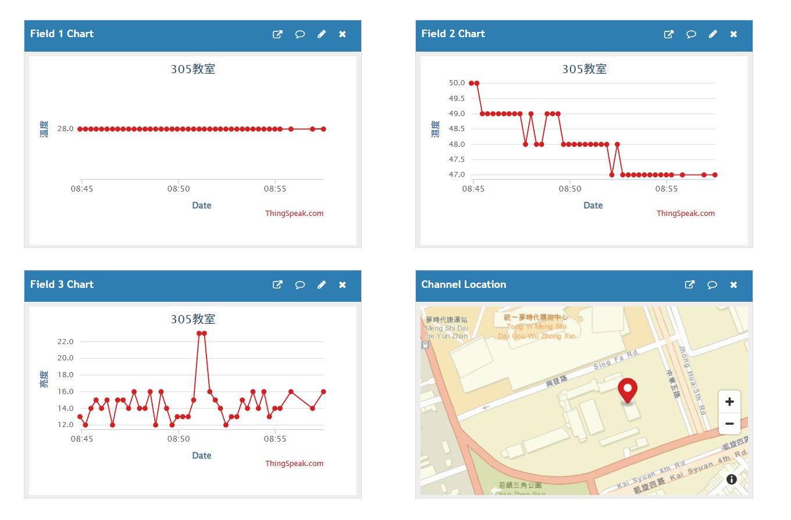

ThingSpeak 儲存的 305 教室感測資料與歷史圖表。

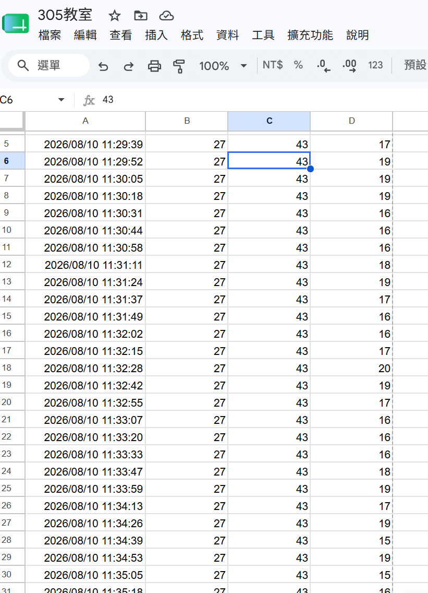

Google Sheets 持續記錄時間戳記、溫度、濕度與亮度欄位。

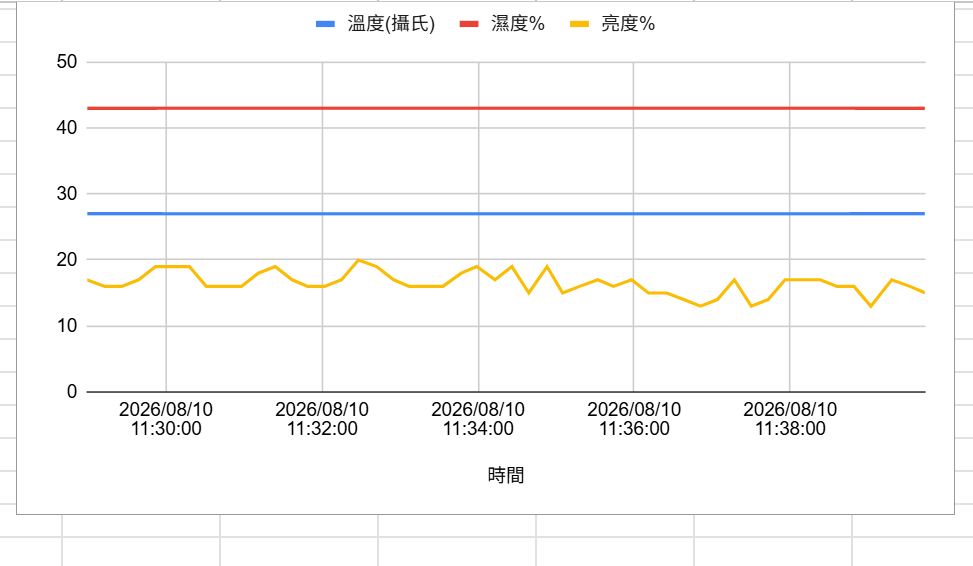

Google Sheets 將三種感測值繪製成時間序列圖，方便觀察環境變化。

為保護個人資料，含姓名／學號與個人訊息的照片未放入公開 repository。

## 注意事項

- 本 repository 不包含 Wi-Fi 密碼、雲端 API key、LINE token 或 MQTT 私密憑證；請使用本機設定或環境變數管理機密。
- `_waveshare_ePaper_tmp/` 是本機使用的 Waveshare 暫存／參考資料，約 2 GB，已透過 `.gitignore` 排除，未推送至 GitHub。
- 目前公開內容以 ESP32 實習成果文件產生工具與系統設計說明為主。

## 授權

本專案目前未指定正式開源授權；如需讓他人明確重製或修改，建議後續新增適合的 LICENSE。
